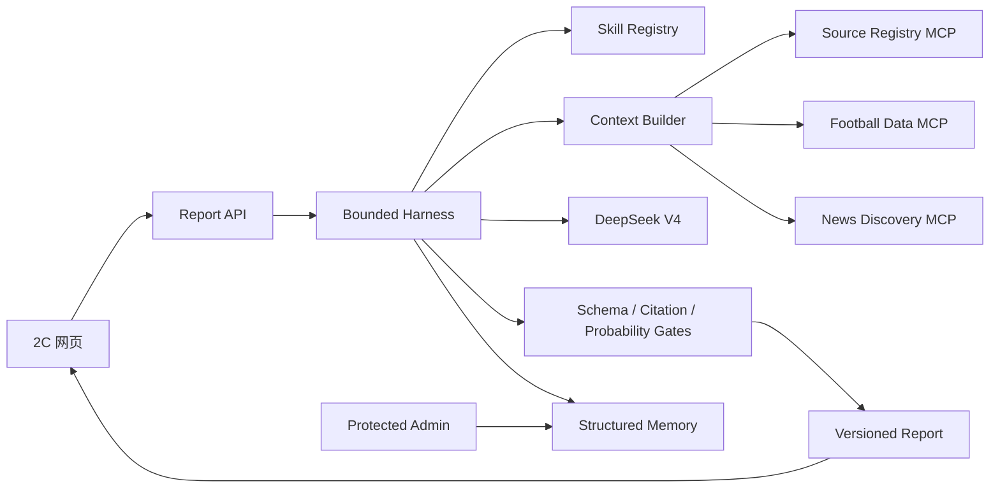

# 球脉 V3：Agent Core、Skills、MCP 与数据架构报告

日期：2026-06-29

## 1. 产品结论

球脉现在是面向普通球迷和内容创作者的“足球报告生成器”。用户只选择世界杯日报、转会情报或比赛预测，输入主题并得到一份可编辑、可复制、带证据引用的报告。Harness、模型名称、工具轮次和调试信息全部退出公共页面；系统没有社媒凭据和自动发布能力。

## 2. 整体架构

Harness 负责确定性控制：路由 Skill、装载截止时点、调用工具、限制轮次、校验结果、写入检查点和转人工。模型只负责需要判断与表达的部分。这个分工参考了 Anthropic 对 workflow/agent 以及 evaluator-optimizer 的建议、MCP 的 host/client/server 隔离，以及 OpenAI 对 harness engineering 的实践。

## 3. 三个真实 Skill

### world-cup-daily 2.0

工具链是 Source Registry → football-data.org → GDELT discovery → 官方/双源核验。日报按北京时间窗口收集赛果、赛程、晋级影响和重要新闻，同一事件的转载先聚类。上限为 3 个模型轮次、7 个工具轮次，失败修订一次后转人工。

### transfer-daily 2.0

先发现候选 URL，再做球员和俱乐部实体消歧、事件聚类与转载关系解析。状态只允许“传闻、接触、谈判、报价、原则协议、体检、官宣、辟谣”。至少两个独立来源或一个官方来源才能升级事实。Transfermarkt 在注册表中为 blocked，不会被生产抓取。

### match-prediction 2.0

预测采用三个职责清晰的席位：Form Analyst（V4 Flash）形成支持性判断；Skeptic（V4 Flash）独立寻找反证和未知项；Judge（V4 Pro）读取两份结构化意见和原始证据，处理分歧并给出最终报告。确定性 Validator 再校验胜平负/晋级概率总和、证据 ID、截止时间和 schema。只有校验失败才允许一次 Pro 修订，之后转人工。

最大模型轮次 5，正常路径使用 3 轮。系统不保存任何席位的隐藏思维链，只保留结构化观点、概率、引用和未知项。后续用 Brier score、log loss 与 calibration curve 做赛后校准，不用“猜对比分次数”评价模型。

## 4. MCP 设计与落地

本轮使用官方 Python SDK `mcp>=1.27,<2` 和 FastMCP，三个服务都可用 stdio 启动：

- `services.mcp_servers.source_registry`：返回批准、候选和禁止来源，是唯一授权真相。
- `services.mcp_servers.football_data`：读取 football-data.org 世界杯比赛；密钥只来自 `FOOTBALL_DATA_API_KEY`。
- `services.mcp_servers.news_discovery`：读取 GDELT 的标题、URL、域名、时间与语言，不读取或保存全文。

共同防护包括 5 秒连接超时、15 秒总超时、2 MB 响应上限、最多 50 条新闻、最多 100 场比赛、禁止重定向、后端环境变量密钥和只读工具。生产换成 Streamable HTTP 时需要 OAuth/短期服务身份、网络 allowlist 和逐工具授权。

## 5. 数据源决策

| 来源 | 用途 | 决策 |
|---|---|---|
| football-data.org | 赛程、赛果、积分、球队 | MVP 默认；世界杯在免费覆盖中，按套餐限流 |
| FIFA 官方 | 官方赛程、赛果、公告核验 | S0；首期人工核验，不默认网页抓取 |
| GDELT DOC 2.0 | 全球新闻发现 | 默认 discovery；条目不能直接升级为事实 |
| Sportmonks v3 | 阵容、事件、统计、xG | 推荐生产深度数据；签约后接入 |
| NewsAPI | 新闻发现 | 只有 Business 及以上可生产，当前不启用 |
| Transfermarkt | 转会参考 | 未取得书面权限前禁止自动采集 |

具体状态、端点、凭据名与保存策略记录在 `config/source_registry.json`。来源登记是运行时政策，不是建议清单。

首批媒体域名登记在 `config/publisher_registry.json`：FIFA/UEFA/联赛和俱乐部官网用于官方核验；Reuters、BBC Sport、Sky Sports、Guardian Football、ESPN Soccer 与 The Athletic 用于新闻交叉验证。所有媒体均采用“发现 + 引用”而非全文抓取；俱乐部或足协域名首次使用前必须人工确认确为官网。

## 6. 记忆与后台

记忆分三层：单次运行上下文（临时）、领域记忆（事件图、来源可靠度、已发布故事索引、预测校准）和审计记录（版本与权限操作）。聊天历史不进入任何事实表。

后台按 Source、Football、Editorial、Agent、Governance 五域组织。公共网页无法访问后台目录；后台默认关闭，令牌通过后只能查看目录。未来写接口必须叠加 RBAC，尤其是更正、比赛结果和模型配置。

## 7. DeepSeek 与隐私

项目已实现真实 OpenAI-compatible `/chat/completions` 调用、JSON mode、thinking 开关、V4 Flash/Pro 路由、超时、错误脱敏和 token 统计。密钥不进入浏览器、日志、Git 或报告。2026-06-29 的实测请求已到达 DeepSeek，但当前环境密钥返回 HTTP 401，因此结论是“协议已接通、凭据未通过”；更换有效密钥即可复测，无需改代码。

外部数据联调同样区分“实现”与“凭据/网络可用”：Source Registry 已通过真实 MCP stdio 初始化并列出 2 个 tools、2 个 resources；当前未配置 football-data.org token；GDELT 直连冒烟请求在本机网络 15 秒内超时，因此未把联网取数标记为通过。

## 8. 验证与下一步

自动测试覆盖 API、报告 schema、预测概率、引用、预测委员会、后台权限、来源策略和 DeepSeek 适配器。浏览器验证覆盖桌面和移动端首页、类型切换与报告生成。

建议先申请 football-data.org token，在 3 天影子运行中对照 FIFA；随后决定是否购买 Sportmonks World Cup 套餐。新闻侧先用 GDELT 评估召回率，再决定是否购买 NewsAPI Business。有效 DeepSeek 密钥到位后运行真实三席预测，但积累至少 30 场冻结预测前，不对外宣称模型“准确”。

## 参考资料

- [DeepSeek API 文档](https://api-docs.deepseek.com/)
- [MCP 官方 Python SDK](https://github.com/modelcontextprotocol/python-sdk)
- [MCP Architecture](https://modelcontextprotocol.io/docs/learn/architecture)
- [Anthropic: Building Effective Agents](https://www.anthropic.com/engineering/building-effective-agents)
- [Anthropic: Effective Context Engineering](https://www.anthropic.com/engineering/effective-context-engineering-for-ai-agents)
- [Anthropic: Agent Skills](https://www.anthropic.com/engineering/equipping-agents-for-the-real-world-with-agent-skills)
- [OpenAI: Harness Engineering](https://openai.com/index/harness-engineering/)
- [football-data.org Coverage](https://www.football-data.org/coverage)
- [football-data.org Pricing](https://www.football-data.org/pricing)
- [FIFA World Cup 2026 schedule/results](https://www.fifa.com/en/tournaments/mens/worldcup/canadamexicousa2026/articles/match-schedule-fixtures-results-teams-stadiums)
- [Sportmonks World Cup 2026 API](https://www.sportmonks.com/blogs/world-cup-2026-api-guide-coverage-endpoints-data-types/)
- [GDELT DOC 2.0](https://blog.gdeltproject.org/gdelt-doc-2-0-api-debuts/)
- [NewsAPI Pricing](https://newsapi.org/pricing)
