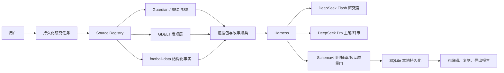

# 球脉 V5：可用版 Agent Core 实施报告

- 日期：2026-07-01
- 产品入口：`http://127.0.0.1:8765/`
- 用户产品：《今日球脉》与《比赛预测》

## 1. 交付结论

V5 已从同步单源报告升级为持久化、多来源、有界多模型产品。日报与转会在用户侧合并为《今日球脉》，后台仍由赛事新闻桌和转会市场桌独立研究。比赛预测同时支持球脉综合研判、可复现统计基线和有证据的外部观点。

## 2. 当前运行架构

## 3. 《今日球脉》Loop

1. RSS 与 GDELT 并行发现；只接受 Source Registry 批准域名。
2. 规范化 URL、来源独立键和故事聚类；同一转载链不算多源。
3. Flash 赛事桌提取赛果、球队动态、晋级影响和观赛重点。
4. Flash 转会桌提取官宣、报价、谈判、接触、体检、否认和绯闻。
5. 两个 Pro 主笔分别生成赛事栏目与转会栏目。
6. Pro 总编辑去重、排序并整合为《今日球脉》。
7. 代码检查引用、截止时间、来源 ID、传闻标签和输出 Schema。
8. 失败最多修订一次；最多 7 个模型轮次、12 个工具轮次。

`unverified_lead` 可以进入传闻雷达，但引用它的段落必须出现“传闻、据报道、未核实、线索或尚未确认”。模型无法把发现层标题升级为已确认事实。

## 4. 比赛预测 Loop

1. 冻结截止时点证据和结构化比赛快照。
2. 每队至少三场结构化赛果时计算 Poisson；若存在有来源 Elo，则使用 Elo+Poisson。
3. Flash Form Analyst 与 Flash Skeptic 独立并行判断。
4. Pro Judge 对照统计基线审阅分歧，输出球脉综合预测。
5. 从证据中确定性提取 Opta/Stats Perform/媒体的明确预测陈述。
6. 检查 90 分钟概率、淘汰赛晋级概率、引用、外部来源和 Schema。
7. 赛后由 `result_writer` 写入赛果，累计 Brier Score 与 Log Loss。

单个 Flash 席位遇到瞬时 5xx 时先有限重试；仍失败则降级到剩余席位与 Pro，而不是让整单 502。两个席位都失败时，Pro 只能使用原始证据保守输出，并必须披露降级。

## 5. 来源与合规

| 来源 | 当前状态 | 用途 |
|---|---|---|
| Guardian Football RSS | 实际运行 | S1 出版方报道，元数据和短摘录 |
| BBC Sport Football RSS | 实际运行 | 第二独立 S1 出版方 |
| GDELT DOC | 已实现，网络失败时降级 | 批准域名的多语言线索发现，不作为唯一事实 |
| football-data.org | 已实现，需供应商 Key | 赛程、赛果和近期比赛样本 |
| FIFA | 人工 S0 核验 | 官宣、赛程和赛果最终核对 |
| Transfermarkt | 明确阻止 | 未取得书面许可前不采集 |

不保存完整新闻正文、付费原文、图片、模型二进制、用户社媒凭据或隐藏思维链。

## 6. 持久化、进度和后台

- `research_jobs`：请求、真实阶段、进度、最终报告和失败状态。
- `prediction_outcomes`：赛果、Brier Score、Log Loss。
- `audit_logs`：任务创建/完成与赛果写入。
- 服务重启时，未完成模型调用标记为 `interrupted`，不伪装恢复。
- 公共页面使用异步任务和轮询，进度来自后端阶段事件。
- `/v1/admin/*` 默认返回 404；启用后需要管理令牌。
- 赛果写入额外要求 `X-Admin-Role: result_writer`。

本地 Beta 使用 SQLite WAL；生产多实例迁移到 PostgreSQL + Temporal，领域接口不变。

## 7. 隐私与成本控制

- DeepSeek Key 只在服务进程环境中存在，不写入浏览器、数据库、日志或 Git。
- 模型、工具、重试、超时和最大轮次全部有硬上限。
- 同时执行的研究任务默认不超过 2 个。
- 网页启用 CSP、no-referrer、no-store/no-cache 和权限策略。
- 产品不包含社媒凭据字段、发布工具或模拟用户发布行为。

## 8. 验证证据

- 自动化测试：35 项通过。
- Ruff：通过。
- Git diff whitespace：通过。
- 密钥模式扫描：未发现工作区凭据。
- 实际来源：Guardian + BBC 同次采集得到 16 条资料；GDELT 超时安全降级。
- 真实《今日球脉》：2 家来源、10 条资料、约 80 秒完成。
- 真实比赛预测：4 次模型调用、约 90 秒完成；此前瞬时 502 路径已修复。
- 浏览器验证：两种报告均完成展示，无页面错误。

## 9. 当前外部配置边界

DeepSeek 已实际连接。football-data.org 连接器需要 `FOOTBALL_DATA_API_KEY`；没有该凭据时，系统继续生成证据型 AI 预测，但隐藏统计基线并说明数据缺口。该行为是安全降级，不是使用默认或虚构统计数据。
