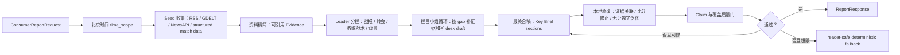

# 今日球脉证据护栏与 Key Brief 设计说明

## 背景

2026-07-06 的复测暴露出三个核心问题：

1. 日期和时区边界容易混乱，尤其是用北京时间自然日收集世界杯赛果时。
2. 基础赛果和基础转会可以收集到，但细节、人物、教练和阶段信息不足。
3. 旧补丁过多依赖最终模型自我修复，导致输出不稳定，甚至把点球比分、总比分和常规时间比分互相污染。

本轮目标不是让模型自由创作一篇长文，而是把系统改成“关键信息整合商”：先收全关键事实，再让模型在严格证据边界内做取舍、组织和表达。

## 设计原则

- **事实层先于生成层**：比赛清单、比分、开球时间、状态和结构化缺口先进入证据包。
- **缺口显式化**：没有进球者、分钟、红黄牌或合同细节时，写入 `warnings` 或【边界】，不让模型补写。
- **模型少做脏活**：时间窗口、点球大战、转会阶段、数字归一化和证据引用由系统注入或校验。
- **小修复本地完成**：无证 `16强`、比分方向、金额单位换算等可确定修复在质量门前完成，不把整篇推入兜底。
- **搜索受治理**：模型可以提出 coverage gaps，但新增搜索 MCP 必须进入 Source Registry，带预算、超时、重试和证据校验。
- **媒体先关闭**：图片、视频、GIF、高光暂时不参与日报链路，避免许可和相关性问题干扰文本质量。

## 运行链路



## Key Brief 合同

每个 section 必须使用统一短卡片结构：

```text
【核心】当天最重要、证据确认的事实。
【细节】比分变化、进球者、红牌、点球、转会金额/阶段、教练履历等证据中已有的细节。
【背景】为什么这条值得读者关注。
【下一步】接下来要看哪场比赛、官宣、阵容或合同节点。
【边界】证据缺什么，哪些信息不能补写。
```

最终报告不再要求长段落战报，也不规划图片、视频、GIF 或高光候选。

## 关键护栏

### 1. 北京时间自然日

`report_date` 解释为 `Asia/Shanghai` 的 00:00-24:00，并转换为 UTC 半开窗口。结构化赛程和新闻检索都使用同一个 `time_scope`，避免“7月5日生成却混用7月3日/当地时间”的问题。

### 2. 结构化赛果优先

`football-data.org` 赛果进入 S1 证据，正文若涉及已完赛比赛，优先引用结构化赛果。若新闻段落提到比分但只引用媒体来源，系统会尝试自动附加同场结构化证据，避免最终 claim gate 因引用不完整失败。

### 3. 数字归一化

`claim_ledger` 会把证据数字归一化后再校验：

- `2-1` 和中文叙事中的 `1-2` 可按球队顺序校准。
- `£43m` 与 `4300万英镑` 可互相识别。
- ISO 日期里的年月日可作为证据数字，但不会被当成比分。
- 无证阶段数字会被泛化，例如 `16强` 变为“淘汰赛阶段”。

### 4. 比分修复边界

比分修复只修整场结果，不批量替换带标签的分项比分：

- 保留 `常规时间 1-1`
- 保留 `点球 2-4`
- 修正 `法国0-1战胜巴拉圭` 为 `法国1-0战胜巴拉圭`
- 不把点球比分误改成常规比分或总比分

### 5. 覆盖门槛

覆盖检查现在支持中文紧凑比分，例如 `阿根廷3-2击败佛得角`。此前英文词边界规则会漏判这类文本，导致已经有比分的段落被误认为“没有比赛细节”。

## 质量门与降级

质量门分为三层：

1. **结构校验**：sections、evidence_ids、category、warnings 等 schema 必须正确。
2. **claim gate**：正文数字、比分、引用、直接引语必须由引用证据支持。
3. **coverage gate**：Leader 栏目必须被覆盖；战报栏目若有已完赛和细节证据，正文必须包含比分、分钟、进球、红黄牌或 VAR 等至少一种细节。

失败路径按顺序处理：

1. 本地可确定修复。
2. 带错误列表请求模型重写。
3. 若仍失败，进入 reader-safe deterministic fallback，只输出证据中可确定的事实和边界。

## 已验证真实链路

本轮用 DeepSeek live 服务跑通了一条日报任务：

- Job: `d859eb9f-13c4-4f77-8925-ac767bff957e`
- 日期：北京时间 `2026-07-04`
- Evidence: 25 条
- Media assets: 0
- Desk drafts: 4 个栏目、8 个 section
- Final synthesis: attempt 1 accepted
- Final phase: `quality_gate -> completed`

中间事件覆盖：

```text
url_collection -> evidence_refinement -> leader_review -> column_team_loop
-> research_desks -> desk_drafts_ready -> editor_synthesis -> quality_gate
```

## 验证命令

```powershell
.venv\Scripts\python.exe -m pytest tests\report_api -q
.venv\Scripts\python.exe -m ruff check services\report_api tests\report_api
```

## 后续工作

1. 将搜索 MCP 做成 Source Registry 管理的 gap-driven connector，而不是让最终写作者自由浏览。
2. 为赛事情报补第二独立结构化来源，特别是进球者、分钟、红黄牌和换人事件。
3. 恢复媒体能力前，先补许可、相关性和前端展示质量门。
4. 建立失败样本集，把比分、点球、转会金额、教练履历和中文紧凑表达纳入回归评测。
