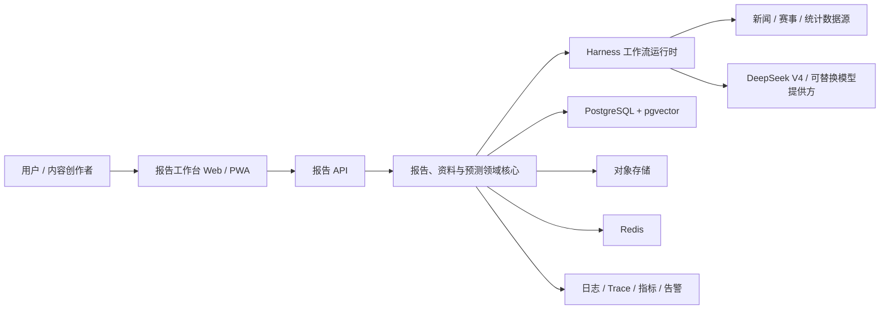
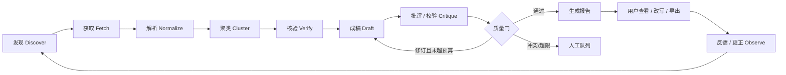
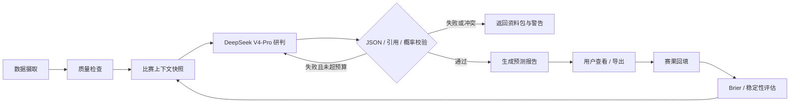

# 系统架构设计

## 1. 架构目标

支持世界杯期间快速上线，同时确保报告可追溯、可重放、可停止、可降级。第一阶段采用模块化单体和大模型 API，工作流任务独立进程部署；达到明确容量或团队边界后再拆服务。

## 2. 系统上下文



## 3. 推荐技术基线

| 层 | MVP 选择 | 理由 |
|---|---|---|
| Web/PWA | Next.js + TypeScript | 报告表单、流式进度、报告查看与导出 |
| 产品 API | FastAPI + Python | 与采集、NLP、模型共享语言和类型 |
| 工作流 | Temporal | 持久化执行、定时、重试、暂停、可重放 |
| 关系数据 | PostgreSQL | 主张、来源、文章、比赛和版本均适合关系模型 |
| 语义检索 | pgvector | MVP 避免单独维护向量库 |
| 缓存/限流 | Redis | 热点比赛、任务锁、配额与短期缓存 |
| 原文/制品 | S3 兼容对象存储 | 保存许可范围内的抓取快照、特征和模型制品 |
| 大模型 API | DeepSeek V4（OpenAI-compatible） | Flash 处理批量步骤，Pro 处理最终综合与研判 |
| 可观测性 | OpenTelemetry + Sentry + Prometheus/Grafana | 统一追踪工作流、API 与模型运行 |

技术版本在实现时锁定，不把具体 LLM 或数据商写死在领域层。

## 4. 模块边界

```text
identity          用户、角色、订阅、审计主体
source-registry   数据源、许可、配额、可信等级、采集适配器
ingestion         获取、解析、原始快照、幂等键
knowledge         实体解析、主张、证据、事件簇、冲突关系
reports           请求、报告、引用、版本、改写、复制与导出
tournament        比赛、赛程、结果、球队、阵容、事件
prediction        比赛上下文、LLM 研判、预测快照、结果评估
workflow          Harness 状态机、工具权限、重试、暂停、恢复
delivery          Web API、搜索、Markdown/文本/JSON 导出
observability     Trace、质量指标、成本、反馈与告警
```

模块只能通过显式接口和领域事件交互。报告不能直接写入比赛事实表；预测步骤只能读取已通过数据质量门的上下文快照。

## 5. Harness：模型外的可靠性运行时

Harness 不等于一个提示词，也不等于自主智能体集合。它包含：

1. **任务控制器**：显式状态机/DAG、截止时间、预算和终止条件。
2. **上下文构建器**：只装载当前步骤所需的主张、证据与模板。
3. **工具注册表**：按角色授权采集、检索、写报告、评估和导出；不存在社媒发布工具。
4. **记忆与状态**：工作流状态存在数据库；LLM 对话历史不是事实源。
5. **验证器**：结构校验、引用覆盖、数值一致性、事实冲突和敏感内容检查。
6. **用户在回路**：低置信度和冲突消息显示在报告中，最终编辑和社媒发布由用户完成。
7. **可观测性**：记录输入版本、提示词版本、模型、工具调用、输出、成本与判定。
8. **评估器**：离线样本、线上反馈和失败聚类反向改进规则、提示词和模型。

### 5.1 运行约束

- 每次运行有 `run_id`、幂等键、最大步数、最大重试与成本预算。
- 模型只能提出工具调用；Harness 校验参数、权限、配额后执行。
- 工具输出视为不可信输入，必须经过 schema 与安全检查。
- LLM 不能对外发布、改比赛结果、覆盖原始记录或自行切换模型配置。
- 超限、来源冲突或校验失败进入人工队列/死信队列，不无限自修复。

## 6. 两条 Loop

### 6.1 内容闭环



`Critique` 只返回结构化问题清单，不直接覆写原稿。最多两轮自动修订，避免循环漂移。

### 6.2 LLM 预测报告闭环



MVP 不训练自有模型。DeepSeek V4-Pro 以结构化 JSON 同时返回概率、支持证据、反方证据和不确定性；Harness 只做确定性校验，不伪装成统计校准。实际赛果持续进入评估，必要时再增加轻量统计基线。

## 7. 模型提供方接口

```text
LLMProvider.generate(request) -> LLMResult

request: purpose, messages, response_schema, thinking_mode,
         max_output_tokens, timeout, idempotency_key
result:  content, parsed_output, provider, model,
         usage, latency, finish_reason, request_id
```

- 默认：抽取/翻译/去重使用 `deepseek-v4-flash`，最终报告/比赛研判使用 `deepseek-v4-pro`。
- `base_url`、模型名和密钥只来自配置；领域代码不出现供应商 SDK 类型。
- 请求使用上下文哈希缓存；超时和重试按错误类型处理，禁止对未知结果盲目重放收费请求。
- JSON schema、成本上限和最大输出长度按报告类型配置。
- 保留 mock provider，使本地开发和 CI 不需要真实 API Key。

## 8. 核心数据模型

| 实体 | 关键字段 |
|---|---|
| `Source` | id, domain, type, trust_tier, license_policy, robots_policy |
| `RawDocument` | id, source_id, canonical_url, published_at, fetched_at, content_hash, object_uri |
| `Claim` | id, subject, predicate, object, qualifiers, asserted_at, status |
| `Evidence` | claim_id, document_id, excerpt_locator, stance, extraction_version |
| `StoryCluster` | id, topic, entities, stage, confidence, first_seen, last_seen |
| `ReportRequest` | id, user_id, type, subject, style, length, status, created_at |
| `Report` | id, request_id, title, body, citations, warnings, current_version_id |
| `ReportVersion` | id, report_id, format, body, prompt_version, created_by |
| `Match` | id, provider_ids, teams, kickoff_utc, venue, stage, status, result |
| `ContextSnapshot` | id, match_id, cutoff_at, schema_version, data_hash, evidence_ids |
| `LLMRun` | id, purpose, provider, model, prompt_version, usage, latency, output_hash |
| `Prediction` | match_id, llm_run_id, snapshot_id, probabilities, reasoning, created_at |
| `WorkflowRun` | id, type, state, budget, attempts, trace_id, started_at, ended_at |

所有时间在存储层使用 UTC，展示层转为 `Asia/Shanghai`。比赛与球队使用内部稳定 ID，供应商 ID 仅作为映射。

## 9. 对外 API 草案

```text
POST /v1/reports
GET  /v1/reports/{report_id}
POST /v1/reports/{report_id}/rewrite
GET  /v1/reports/{report_id}/export?format=markdown|text|json
GET  /v1/reports?type=&from=&to=
GET  /v1/evidence/{evidence_id}
GET  /v1/matches?from=&to=&timezone=Asia/Shanghai
GET  /v1/matches/{match_id}
GET  /v1/matches/{match_id}/predictions/latest
POST /v1/admin/workflows/{id}/retry
```

写操作使用角色权限、审计日志和幂等键。报告响应包含 `provider`、`model`、`prompt_version`、`data_cutoff` 与 `generated_at`，但不暴露隐藏推理内容。

## 10. 可靠性与降级

- 目标：内容页月可用性 99.9%；赛前 2 小时预测读取 99.95%。
- RPO：15 分钟；RTO：60 分钟。原始数据和已发布版本不可变备份。
- 外部数据源使用断路器、速率限制、指数退避和供应商健康分。
- 单一新闻源故障：继续处理其他源并标记覆盖下降。
- LLM 故障：返回已收集的结构化资料包、来源列表和可重试状态；不伪造完整报告。
- 主数据源故障：冻结赛果/预测更新，页面显示数据截止时间，不用未经批准的抓取源自动顶替。

## 11. 安全与合规

- 密钥放入托管 Secret Store，禁止进入提示词、日志和仓库。
- 外部文档按提示注入不可信内容处理；网页文字不能改变系统规则或调用权限。
- 抓取适配器必须在 Source Registry 中有负责人、许可依据与停用开关。
- 最小化保存用户数据；关注列表与通知订阅分离，支持删除。
- 报告生成、改写、导出、删除与模型配置变更写入审计日志。
- 不接收或保存社媒账号凭据，不提供自动发布接口。

## 12. 演进触发条件

只有满足以下任一条件才拆服务：

- 采集吞吐或故障显著影响用户 API。
- LLM 预测评估证明需要独立统计基线与计算资源。
- 单模块部署频率/权限边界阻塞其他团队。
- PostgreSQL/Temporal 的可观测数据证明存在瓶颈。

在此之前，清晰模块边界比网络边界更重要。
